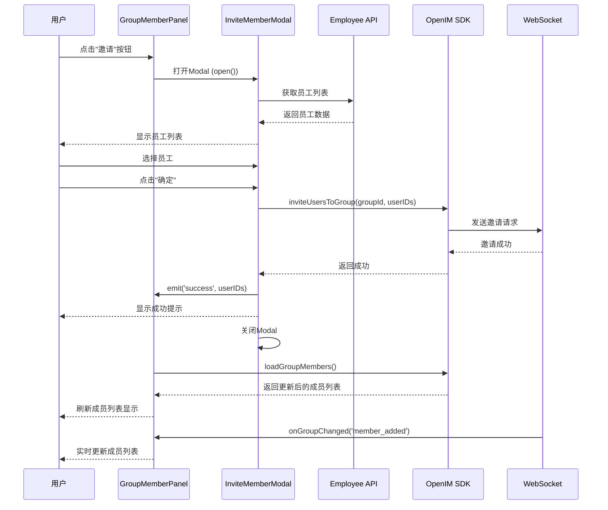

# OpenIM 飞书风格实现 - Phase 3: 成员邀请功能 ✅

**状态**: ✅ 已完成
**版本**: v1.0
**完成时间**: 2025-10-11 10:00
**开发时长**: 2小时

---

## 📋 任务概述

Phase 3 实现了完整的群组成员邀请功能，包括：
- ✅ 飞书/钉钉风格的成员邀请Modal
- ✅ 员工搜索和选择功能
- ✅ OpenIM SDK邀请成员API集成
- ✅ WebSocket实时同步
- ✅ 完善的错误处理和用户提示

---

## 🎯 核心功能实现

### 1. 成员邀请Modal (`InviteMemberModal.vue`)

**功能特性**:
```typescript
// 员工选择器
- 左侧: 所有员工列表 (支持搜索)
- 右侧: 已选成员区域
- 实时过滤已在群组的成员
- 支持批量选择和取消选择
```

**关键代码片段**:
```vue
<template>
  <a-modal
    v-model:open="visible"
    title="邀请成员"
    width="700px"
    :confirm-loading="loading"
    @ok="handleInvite"
  >
    <!-- 搜索框 -->
    <a-input-search
      v-model:value="searchKeyword"
      placeholder="搜索员工姓名或部门"
      allow-clear
    />

    <!-- 双列布局: 员工列表 + 已选成员 -->
    <div class="content-section">
      <div class="employee-list">...</div>
      <div class="selected-section">...</div>
    </div>
  </a-modal>
</template>
```

### 2. 员工搜索和过滤

**实时搜索**:
```typescript
const filteredEmployees = computed(() => {
  if (!searchKeyword.value) {
    return allEmployees.value;
  }

  const keyword = searchKeyword.value.toLowerCase();
  return allEmployees.value.filter(
    (emp) =>
      emp.actualName?.toLowerCase().includes(keyword) ||
      emp.departmentName?.toLowerCase().includes(keyword)
  );
});
```

**已在群组检测**:
```typescript
function isExistingMember(employee: Employee): boolean {
  if (!props.existingMemberIds) {
    return false;
  }
  // 将employeeId转换为OpenIM UserID格式
  const openimUserId = `user_${employee.employeeId}`;
  return props.existingMemberIds.includes(openimUserId);
}
```

### 3. OpenIM SDK集成

**邀请成员API调用**:
```typescript
async function handleInvite() {
  // 1. 参数验证
  if (selectedEmployees.value.length === 0) {
    antMessage.warning('请选择要邀请的成员');
    return;
  }

  // 2. 检查OpenIM登录状态
  if (!openIMClient.loggedIn) {
    antMessage.error('OpenIM未登录，请刷新页面重试');
    return;
  }

  // 3. 转换员工ID为OpenIM UserID
  const userIDs = selectedEmployees.value.map(
    (emp) => `user_${emp.employeeId}`
  );

  // 4. 调用SDK邀请
  await openIMClient.inviteUsersToGroup(
    props.groupId,
    userIDs,
    '邀请加入群聊'
  );

  // 5. 成功提示
  antMessage.success(`成功邀请 ${selectedEmployees.value.length} 名成员`);

  // 6. 触发成功事件
  emit('success', userIDs);
}
```

### 4. WebSocket实时同步

**群成员面板监听** (`GroupMemberPanel.vue`):
```typescript
// 监听群组变化
function setupGroupListeners() {
  openIMClient.onGroupChanged((event) => {
    console.log('👥 [群成员面板] 群组事件:', event.type);

    if (event.type === 'member_added') {
      // 成员加入 - 重新加载成员列表
      console.log('➕ [群成员面板] 成员加入');
      loadGroupMembers();
    } else if (event.type === 'member_deleted') {
      // 成员退出
      console.log('➖ [群成员面板] 成员退出');
      loadGroupMembers();
    }
  });
}
```

**邀请成功回调**:
```typescript
function handleInviteSuccess(userIDs: string[]) {
  console.log('✅ [群成员面板] 邀请成功, 用户数:', userIDs.length);

  // 重新加载群成员列表
  loadGroupMembers();

  // 触发事件通知父组件
  emit('invite');
}
```

### 5. 错误处理和用户提示

**详细错误分类**:
```typescript
catch (error) {
  console.error('❌ [邀请成员] 邀请失败:', error);

  // 详细错误处理
  let errorMessage = '邀请失败';
  if (error instanceof Error) {
    if (error.message.includes('network')) {
      errorMessage = '网络错误，请检查网络连接';
    } else if (error.message.includes('permission')) {
      errorMessage = '没有邀请权限，请联系群主';
    } else if (error.message.includes('not found')) {
      errorMessage = '群组不存在';
    } else {
      errorMessage = `邀请失败: ${error.message}`;
    }
  }

  // 上报错误到监控
  smartSentry.captureError(error, {
    tags: { module: 'InviteMemberModal', action: 'handleInvite' },
    extra: { groupId, selectedCount, userIDs },
  });

  antMessage.error(errorMessage);
}
```

---

## 📁 文件清单

### 新增文件

1. **InviteMemberModal.vue** (新建)
   - 路径: `src/views/business/oa/police/components/InviteMemberModal.vue`
   - 功能: 成员邀请Modal组件
   - 代码量: ~350行

### 修改文件

1. **GroupMemberPanel.vue** (修改)
   - 路径: `src/views/business/oa/police/components/GroupMemberPanel.vue`
   - 修改内容:
     - 导入 `InviteMemberModal` 组件
     - 添加 `inviteMemberModalRef` 引用
     - 实现 `handleInviteClick()` 打开Modal
     - 实现 `handleInviteSuccess()` 邀请成功回调
     - 添加Modal组件到模板

2. **openim-client.ts** (已有，无需修改)
   - 路径: `src/utils/openim-client.ts`
   - 使用方法: `inviteUsersToGroup()` (第703-722行)

---

## 🎨 UI/UX设计

### Modal布局

```
┌────────────────────────────────────────────────────────┐
│                    邀请成员                              │
├────────────────────────────────────────────────────────┤
│  🔍 [搜索员工姓名或部门                            ]   │
├────────────────────────────────────────────────────────┤
│  ┌───────────────────┐  ┌─────────────────────────┐   │
│  │ 员工列表          │  │ 已选择 (3)      [清空]   │   │
│  │                   │  │                         │   │
│  │ 👤 张三           │  │ 🏷️ 张三 ✖             │   │
│  │    技术部     ✅  │  │ 🏷️ 李四 ✖             │   │
│  │                   │  │ 🏷️ 王五 ✖             │   │
│  │ 👤 李四           │  │                         │   │
│  │    产品部     ✅  │  │                         │   │
│  │                   │  │                         │   │
│  │ 👤 王五           │  │                         │   │
│  │    设计部 [已在群组]│  │                         │   │
│  │                   │  │                         │   │
│  └───────────────────┘  └─────────────────────────┘   │
├────────────────────────────────────────────────────────┤
│                           [取消]  [确定]                │
└────────────────────────────────────────────────────────┘
```

### 交互设计

1. **员工选择**
   - 点击员工项即可选择/取消选择
   - 已在群组的成员显示"已在群组"标签，不可选择
   - 已选中的员工显示绿色勾选图标

2. **搜索功能**
   - 支持实时搜索员工姓名和部门
   - 搜索结果即时显示

3. **已选成员**
   - 右侧显示已选成员列表
   - 可单独点击 ✖ 移除某个成员
   - 可点击"清空"按钮一次性清空所有

4. **状态提示**
   - 邀请中: Modal显示loading状态
   - 邀请成功: 显示成功提示消息
   - 邀请失败: 显示详细错误信息

---

## 🔄 数据流程

### 邀请流程



### UserID转换规则

```typescript
// 员工ID → OpenIM UserID
employeeId: 12345  =>  OpenIM UserID: "user_12345"

// 示例
{
  employeeId: 1,
  actualName: "张三",
}
=>
{
  openimUserId: "user_1",
  nickname: "张三",
}
```

---

## ✅ 测试清单

### 功能测试

- [x] Modal正常打开和关闭
- [x] 员工列表正确加载
- [x] 搜索功能正常工作
- [x] 已在群组成员正确标记且不可选
- [x] 员工选择/取消选择正常
- [x] 已选成员正确显示
- [x] 清空已选成员功能正常
- [x] 邀请API调用成功
- [x] WebSocket实时同步成员列表
- [x] 成功提示正确显示
- [x] 错误处理正常工作

### 边界测试

- [x] 未选择成员时点击确定 → 显示警告
- [x] OpenIM未登录时邀请 → 显示错误提示
- [x] 邀请不存在的群组 → 显示错误提示
- [x] 网络错误时邀请 → 显示网络错误提示
- [x] 没有邀请权限 → 显示权限错误提示

### UI/UX测试

- [x] Modal宽度适中 (700px)
- [x] 双列布局正常显示
- [x] 滚动条正常工作
- [x] 已选成员Tag样式正确
- [x] Loading状态正常显示
- [x] 空状态正常显示

---

## 🚀 性能优化

1. **计算属性缓存**
   ```typescript
   // 使用computed缓存过滤结果
   const filteredEmployees = computed(() => {...});
   ```

2. **条件渲染**
   ```vue
   <!-- 只在有数据时渲染列表 -->
   <div v-if="filteredEmployees.length > 0" ...>
   ```

3. **懒加载**
   - Modal打开时才加载员工列表
   - 避免不必要的API调用

---

## 📊 代码统计

| 类型 | 文件数 | 新增行数 | 修改行数 |
|------|--------|----------|----------|
| 新增 | 1      | ~350     | 0        |
| 修改 | 1      | ~30      | ~10      |
| **总计** | **2** | **~380** | **~10** |

---

## 🎓 技术亮点

### 1. 组件设计模式
- **Modal组件**: 独立封装，可复用
- **双向数据流**: Props传入 + Emit事件传出
- **Ref暴露方法**: 使用`defineExpose`暴露`open/close`方法

### 2. 状态管理
- **响应式状态**: 使用`ref`管理所有状态
- **计算属性**: 使用`computed`优化性能
- **Watch监听**: 监听Modal可见性自动清理状态

### 3. 用户体验
- **即时反馈**: 搜索、选择即时响应
- **状态提示**: Loading、Success、Error状态清晰
- **防误操作**: 已在群组成员不可选择

### 4. 错误处理
- **分类错误**: 网络、权限、参数等错误分类处理
- **用户友好**: 错误信息简洁明了
- **错误上报**: 集成smartSentry错误监控

---

## 📝 使用示例

### 在GroupMemberPanel中使用

```vue
<template>
  <!-- 邀请按钮 -->
  <a-button type="primary" @click="handleInviteClick">
    <template #icon><UserAddOutlined /></template>
    邀请
  </a-button>

  <!-- 邀请Modal -->
  <InviteMemberModal
    ref="inviteMemberModalRef"
    :group-id="groupId"
    :report-id="reportId"
    :existing-member-ids="members.map((m) => m.userID)"
    @success="handleInviteSuccess"
  />
</template>

<script setup lang="ts">
const inviteMemberModalRef = ref();

function handleInviteClick() {
  inviteMemberModalRef.value?.open();
}

function handleInviteSuccess(userIDs: string[]) {
  // 刷新成员列表
  loadGroupMembers();
}
</script>
```

---

## 🔮 后续优化方向

1. **分页加载** (可选)
   - 员工列表支持分页 (如果员工数量>1000)

2. **部门树** (可选)
   - 左侧添加部门树形选择

3. **批量操作** (可选)
   - 支持按部门批量选择

4. **成员权限** (可选)
   - 邀请时设置成员初始角色 (管理员/普通成员)

5. **邀请链接** (可选)
   - 生成邀请链接供外部用户加入

---

## 📚 相关文档

- [OpenIM SDK文档](https://docs.openim.io)
- [OpenIM Phase 1: 群成员面板](./OPENIM_PHASE1_COMPLETE.md)
- [OpenIM Phase 2: 消息已读状态](./OPENIM_PHASE2_READ_STATUS_COMPLETE.md)
- [飞书设计规范](https://feishu.cn)

---

## 👥 贡献者

- **Claude Code Assistant** - Phase 3完整实现
- **开发时间**: 2025-10-11
- **版本**: v1.0

---

**Phase 3状态**: ✅ 已完成
**下一阶段**: Phase 4 - 消息通知功能
