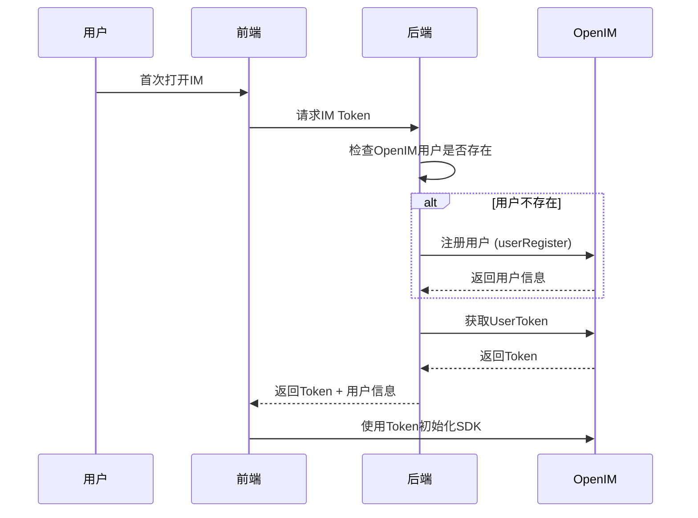
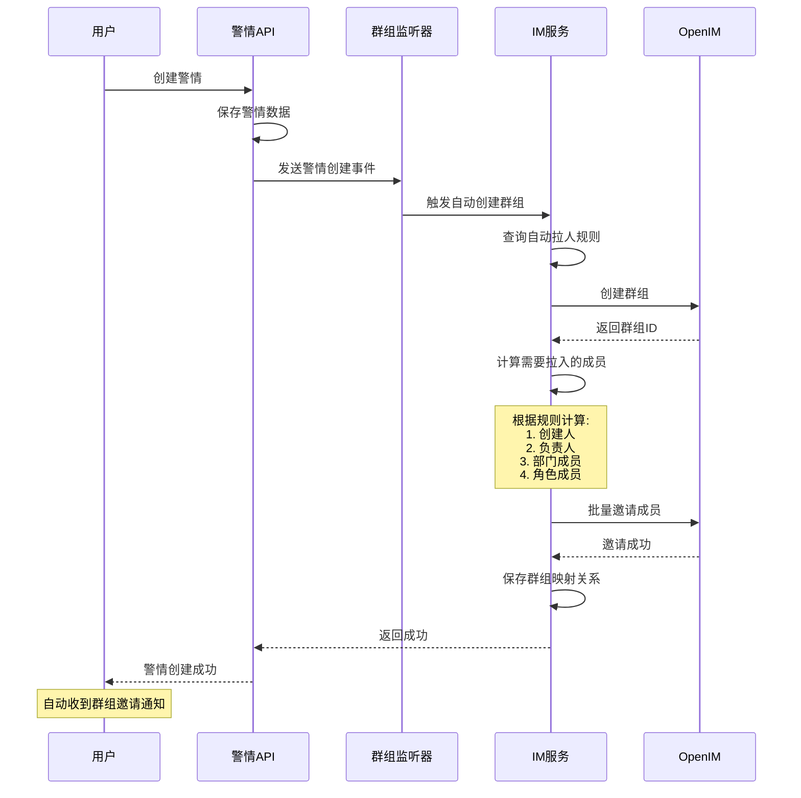
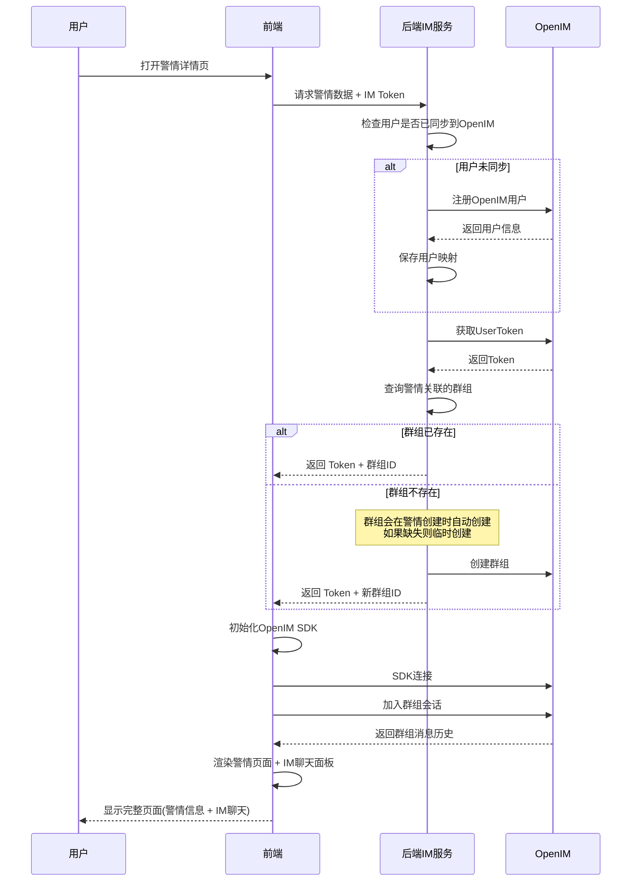
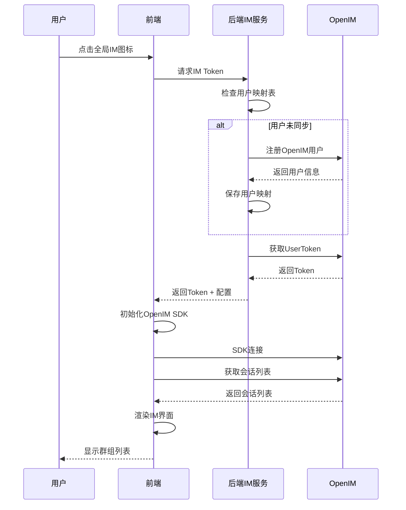

# OpenIM即时聊天集成方案设计

## 📋 项目概述

**目标**: 在SmartAdmin警情管理系统中集成OpenIM即时聊天功能,实现警情协同处理的实时沟通能力。

**核心原则**:
- 🔄 **统一用户体系**: 使用现有SmartAdmin用户,无需额外注册
- 🚀 **自动化**: 警情创建自动创建群组并拉人
- 🎨 **流行设计**: 参考钉钉、企业微信、Slack的IM功能
- 🔐 **权限控制**: 基于现有角色和部门权限
- 📱 **响应式**: 支持桌面端和移动端

---

## 🏗️ 系统架构设计

### 1. 整体架构图

```
┌─────────────────────────────────────────────────────────────┐
│                    SmartAdmin 前端                           │
│  ┌──────────────┐  ┌──────────────┐  ┌──────────────┐      │
│  │  警情管理    │  │  IM聊天窗口  │  │  通知中心    │      │
│  └──────┬───────┘  └──────┬───────┘  └──────┬───────┘      │
│         │                  │                  │              │
└─────────┼──────────────────┼──────────────────┼──────────────┘
          │                  │                  │
          │         ┌────────┴─────────┐       │
          │         │   OpenIM SDK     │       │
          │         │  (Vue3 Component)│       │
          │         └────────┬─────────┘       │
          │                  │                  │
┌─────────┼──────────────────┼──────────────────┼──────────────┐
│         │                  │                  │              │
│  ┌──────▼───────┐  ┌──────▼───────┐  ┌──────▼───────┐      │
│  │警情业务服务  │  │ IM集成服务   │  │ 通知服务     │      │
│  └──────┬───────┘  └──────┬───────┘  └──────┬───────┘      │
│         │                  │                  │              │
│         └──────────────────┼──────────────────┘              │
│                            │                                 │
│                   SmartAdmin 后端 (Spring Boot 3)           │
└────────────────────────────┼─────────────────────────────────┘
                             │
                    ┌────────▼─────────┐
                    │   OpenIM Server  │
                    │  (已部署服务)    │
                    │                  │
                    │ - 用户管理       │
                    │ - 群组管理       │
                    │ - 消息路由       │
                    │ - 在线状态       │
                    └──────────────────┘
```

---

## 👥 用户体系设计

### 1. 用户映射策略

#### SmartAdmin用户 → OpenIM用户

| SmartAdmin字段 | OpenIM字段 | 映射规则 | 说明 |
|---------------|-----------|---------|------|
| employee_id | userID | 直接映射 | 使用员工ID作为OpenIM用户ID |
| actual_name | nickname | 直接映射 | 显示名称 |
| phone | phoneNumber | 直接映射 | 手机号 |
| avatar | faceURL | 直接映射或默认 | 用户头像URL |
| department_id | ex.departmentID | 扩展字段 | 部门信息 |
| position_id | ex.positionID | 扩展字段 | 职位信息 |

#### 用户同步时机

1. **首次登录**: 用户首次访问IM功能时自动注册到OpenIM
2. **信息变更**: SmartAdmin用户信息修改时同步到OpenIM
3. **批量同步**: 系统启动时批量执行同步现有用户

### 2. 用户注册流程



---

## 👫 群组管理设计

### 1. 警情群组自动创建

#### 触发时机
- ✅ 警情新建时自动创建群组
- ✅ 警情分配负责人时拉人入群
- ✅ 警情状态变更时通知群成员

#### 群组命名规则

```
格式: [警情类型] 警情编号 - 简要描述
示例: [火灾] 2025100801 - 某某小区火灾
```

#### 自动拉人规则 (可配置)

| 规则类型 | 条件 | 自动拉入成员 |
|---------|------|------------|
| 创建人规则 | 警情创建时 | 创建人 |
| 负责人规则 | 设置负责人时 | 负责人 |
| 部门规则 | 警情所属部门 | 部门主管、部门成员 |
| 角色规则 | 特定警情类型 | 指定角色成员 (如消防警情→消防队) |
| 协作人规则 | 手动添加协作人 | 被添加的协作人 |

### 2. 群组结构设计

```typescript
interface PoliceGroupInfo {
  groupID: string;              // 群组ID (格式: police_${reportId})
  groupName: string;            // 群组名称
  groupType: number;            // 群组类型 (2=工作群)
  reportId: number;             // 关联的警情ID
  ownerUserID: string;          // 群主 (警情创建人)
  memberCount: number;          // 成员数量
  createTime: number;           // 创建时间
  ex: {
    reportNo: string;           // 警情编号
    reportType: string;         // 警情类型
    status: string;             // 警情状态
    department: string;         // 所属部门
  }
}
```

### 3. 群组权限设计

| 角色 | 权限 |
|-----|------|
| 群主 (警情创建人) | 所有权限 |
| 管理员 (负责人/主管) | 拉人、踢人、修改群信息 |
| 普通成员 | 发送消息、查看历史消息 |

---

## 💬 IM功能设计

### 1. 核心功能清单

参考业界流行IM的功能设计:

#### 基础消息功能
- ✅ **文本消息**: 普通文本、@提醒、表情
- ✅ **富文本**: 图片、文件、语音、视频
- ✅ **引用回复**: 引用某条消息回复
- ✅ **消息撤回**: 2分钟内可撤回
- ✅ **消息已读**: 显示已读/未读状态

#### 高级功能
- ✅ **群公告**: 警情关键信息公告
- ✅ **快捷回复**: 预设常用回复语
- ✅ **消息搜索**: 按关键词、时间、发送人搜索
- ✅ **历史记录**: 完整聊天记录
- ✅ **离线消息**: 离线消息推送

#### 协作功能
- ✅ **任务卡片**: 发送任务提醒卡片
- ✅ **位置共享**: 共享当前位置
- ✅ **文件传输**: 支持各种文件格式
- ✅ **语音通话**: 一对一语音 (可选)
- ✅ **视频会议**: 多人视频 (可选)

### 2. UI设计规范

#### 布局方案: 嵌入式IM面板 (推荐) ⭐

**设计理念**: 一个警情一个群,IM聊天直接嵌入警情详情页面,实现上下文深度整合。

**警情详情页面 + IM聊天面板布局**:

```
┌─────────────────────────────────────────────────────────────────────┐
│  SmartAdmin 顶部导航栏                                               │
├──────┬──────────────────────────────────────────────────────────────┤
│ 导航 │  警情详情页面                                                 │
│ 菜单 │  ┌────────────────────────┬───────────────────────────────┐  │
│      │  │  警情基本信息          │   💬 IM群组聊天               │  │
│      │  │  ────────────────────  │   ───────────────────────────  │  │
│      │  │  编号: 2025100801      │   群组: [火灾] 2025100801     │  │
│      │  │  类型: 火灾            │   成员: 5人 在线: 3人          │  │
│      │  │  状态: 处理中          │   ────────────────────────┐   │  │
│      │  │  创建人: 张三          │   ┌──────────────────────┐│   │  │
│      │  │  负责人: 李四          │   │  消息列表区域        ││   │  │
│      │  │  创建时间: 10-08 14:30 │   │                      ││   │  │
│      │  │                        │   │  [张三 14:30]        ││   │  │
│      │  │  警情描述              │   │  火势已控制,等待处理  ││   │  │
│      │  │  ────────────────────  │   │                      ││   │  │
│      │  │  某某小区3栋发生火灾   │   │  [李四 14:35]        ││   │  │
│      │  │  火势较大,已派出消防车 │   │  已到达现场          ││   │  │
│      │  │                        │   │  [图片] fire.jpg     ││   │  │
│      │  │  协作人员              │   │                      ││   │  │
│      │  │  ────────────────────  │   │  [王五 14:40]        ││   │  │
│      │  │  👤 张三 (创建人)      │   │  @李四 需要增援吗?   ││   │  │
│      │  │  👤 李四 (负责人)      │   │                      ││   │  │
│      │  │  👤 王五 (消防队)      │   │                      ││   │  │
│      │  │  [+ 添加协作人员]      │   └──────────────────────┘│   │  │
│      │  │                        │   ────────────────────────────  │  │
│      │  │  📋 处理历史           │   输入区域                      │  │
│      │  │  ────────────────────  │   ┌──────────────────────────┐ │  │
│      │  │  [展开/收起]           │   │ 😀 📎 📷                │ │  │
│      │  │                        │   │ 输入消息...              │ │  │
│      │  │  📍 位置信息           │   │                          │ │  │
│      │  │  [地图]                │   └─────────────────── [发送] ┘ │  │
│      │  └────────────────────────┴───────────────────────────────┘  │
└──────┴──────────────────────────────────────────────────────────────┘
```

**布局特点**:
- ✅ **上下文整合**: IM聊天与警情信息在同一页面,无需切换
- ✅ **一对一映射**: 每个警情详情页自动关联对应的IM群组
- ✅ **实时协作**: 左侧警情信息 + 右侧即时沟通,提升协作效率
- ✅ **自动关联**: 打开警情详情页自动加载对应群组聊天
- ✅ **成员同步**: 协作人员列表与IM群组成员自动同步
- ✅ **移动优化**: 移动端可切换显示警情信息或IM聊天

**响应式布局**:

**桌面端 (>1200px)**:
- 左侧警情信息占 60%
- 右侧IM聊天占 40%
- 并排显示

**平板端 (768px-1200px)**:
- 左侧警情信息占 50%
- 右侧IM聊天占 50%
- 并排显示

**移动端 (<768px)**:
- Tab切换模式
- Tab1: 警情信息
- Tab2: IM聊天
- 新消息时Tab2显示红点

#### 辅助布局: 全局IM入口 (可选)

对于需要跨警情沟通的场景,可在顶部导航栏添加全局IM入口:

```
┌─────────────────────────────────────────────────┐
│  SmartAdmin Logo    [警情] [统计] 💬[消息(3)]   │
└─────────────────────────────────────────────────┘
                                      ↓
                          点击后弹出全局会话列表
                          ┌──────────────────┐
                          │ 我的群组         │
                          ├──────────────────┤
                          │ [火灾] 2025...(3)│
                          │ [救援] 2025...   │
                          │ [医疗] 2025...(1)│
                          └──────────────────┘
```

### 3. 交互设计

#### 快速操作
- 📌 **快捷键**: Ctrl+Enter发送,@快速提醒
- 📌 **右键菜单**: 复制、引用、转发、删除
- 📌 **拖拽上传**: 拖拽文件到输入框直接发送
- 📌 **表情面板**: 快速插入表情

#### 通知设计
- 🔔 **桌面通知**: 新消息桌面弹窗
- 🔔 **声音提醒**: 可配置提示音
- 🔔 **红点提醒**: 未读消息红点
- 🔔 **免打扰**: 支持群组免打扰

---

## 🔧 技术实现方案

### 1. 后端实现

#### 模块结构

```
sa-admin/src/main/java/net/lab1024/sa/admin/module/business/im/
├── config/
│   ├── OpenIMConfig.java                 # OpenIM配置类
│   └── OpenIMProperties.java             # 配置属性
├── domain/
│   ├── entity/
│   │   ├── ImUserMappingEntity.java      # 用户映射表
│   │   └── ImGroupMappingEntity.java     # 群组映射表
│   ├── vo/
│   │   ├── ImTokenVO.java                # Token响应
│   │   ├── ImGroupVO.java                # 群组信息
│   │   └── ImMessageVO.java              # 消息信息
│   └── form/
│       ├── ImGroupCreateForm.java        # 创建群组表单
│       └── ImMemberInviteForm.java       # 邀请成员表单
├── service/
│   ├── OpenIMApiService.java             # OpenIM API调用服务
│   ├── ImUserSyncService.java            # 用户同步服务
│   ├── ImGroupManageService.java         # 群组管理服务
│   └── ImPoliceGroupService.java         # 警情群组服务
├── controller/
│   ├── ImAuthController.java             # IM认证控制器
│   ├── ImGroupController.java            # 群组管理控制器
│   └── ImMessageController.java          # 消息管理控制器
└── listener/
    └── PoliceGroupAutoCreateListener.java # 警情创建监听器
```

#### 核心API设计

**1. IM认证API**
```java
// 获取IM Token
POST /api/im/auth/token
Response: {
  "userToken": "xxx",
  "userID": "123",
  "expireTime": 1234567890
}

// 刷新Token
POST /api/im/auth/refresh
```

**2. 群组管理API**
```java
// 创建警情群组
POST /api/im/group/police/create
Request: {
  "reportId": 123,
  "autoInviteMembers": true
}

// 邀请成员
POST /api/im/group/invite
Request: {
  "groupID": "police_123",
  "userIDs": ["1", "2", "3"]
}

// 获取警情群组
GET /api/im/group/police/{reportId}

// 获取我的群组列表
GET /api/im/group/my-groups
```

**3. 用户同步API**
```java
// 同步单个用户到OpenIM
POST /api/im/user/sync/{employeeId}

// 批量同步用户
POST /api/im/user/sync/batch

// 同步所有用户
POST /api/im/user/sync/all
```

#### 数据库表设计

**用户映射表 (t_im_user_mapping)**
```sql
CREATE TABLE t_im_user_mapping (
  id BIGINT PRIMARY KEY AUTO_INCREMENT COMMENT '主键',
  employee_id BIGINT NOT NULL COMMENT 'SmartAdmin用户ID',
  open_im_user_id VARCHAR(64) NOT NULL COMMENT 'OpenIM用户ID',
  sync_status TINYINT DEFAULT 1 COMMENT '同步状态:1=已同步,0=待同步',
  last_sync_time DATETIME COMMENT '最后同步时间',
  create_time DATETIME NOT NULL COMMENT '创建时间',
  update_time DATETIME COMMENT '更新时间',
  UNIQUE KEY uk_employee_id (employee_id),
  UNIQUE KEY uk_open_im_user_id (open_im_user_id)
) COMMENT 'IM用户映射表';
```

**群组映射表 (t_im_group_mapping)**
```sql
CREATE TABLE t_im_group_mapping (
  id BIGINT PRIMARY KEY AUTO_INCREMENT COMMENT '主键',
  group_id VARCHAR(64) NOT NULL COMMENT 'OpenIM群组ID',
  business_type VARCHAR(32) NOT NULL COMMENT '业务类型:POLICE=警情群',
  business_id BIGINT NOT NULL COMMENT '业务ID (如警情ID)',
  group_name VARCHAR(128) COMMENT '群组名称',
  owner_user_id VARCHAR(64) COMMENT '群主ID',
  member_count INT DEFAULT 0 COMMENT '成员数量',
  auto_invite_rule TEXT COMMENT '自动拉人规则(JSON)',
  create_time DATETIME NOT NULL COMMENT '创建时间',
  update_time DATETIME COMMENT '更新时间',
  UNIQUE KEY uk_group_id (group_id),
  KEY idx_business (business_type, business_id)
) COMMENT 'IM群组映射表';
```

**自动拉人规则表 (t_im_auto_invite_rule)**
```sql
CREATE TABLE t_im_auto_invite_rule (
  id BIGINT PRIMARY KEY AUTO_INCREMENT COMMENT '主键',
  rule_name VARCHAR(64) NOT NULL COMMENT '规则名称',
  rule_type VARCHAR(32) NOT NULL COMMENT '规则类型:CREATOR,OWNER,DEPARTMENT,ROLE',
  business_type VARCHAR(32) NOT NULL COMMENT '业务类型:POLICE',
  condition_config TEXT COMMENT '条件配置(JSON)',
  enabled TINYINT DEFAULT 1 COMMENT '是否启用:1=是,0=否',
  priority INT DEFAULT 0 COMMENT '优先级',
  create_time DATETIME NOT NULL COMMENT '创建时间',
  update_time DATETIME COMMENT '更新时间'
) COMMENT 'IM自动拉人规则表';
```

### 2. 前端实现

#### 组件结构

```
smart-admin-web-typescript/src/
├── views/business/oa/police/
│   ├── police-report-detail.vue          # 警情详情页 (已集成IM面板)
│   └── components/
│       └── embedded-im-chat.vue          # 嵌入式IM聊天面板 ⭐新增
├── views/business/im/
│   ├── index.vue                         # 全局IM页面 (可选)
│   └── group-manage.vue                  # 群组管理页面
├── components/business/im/
│   ├── im-chat-panel.vue                 # IM聊天面板 (核心组件)
│   ├── im-message-list.vue               # 消息列表组件
│   ├── im-message-item.vue               # 单条消息组件
│   ├── im-input-area.vue                 # 输入区域组件
│   ├── im-emoji-picker.vue               # 表情选择器
│   ├── im-file-upload.vue                # 文件上传组件
│   ├── im-image-preview.vue              # 图片预览组件
│   ├── im-group-header.vue               # 群组头部信息
│   ├── im-group-member-list.vue          # 群成员列表
│   └── im-notification-badge.vue         # 消息通知徽章
├── services/
│   ├── im-auth.service.ts                # IM认证服务
│   ├── im-group.service.ts               # 群组服务
│   ├── im-message.service.ts             # 消息服务
│   └── im-police-integration.service.ts  # 警情IM集成服务 ⭐新增
├── utils/
│   ├── openim-sdk-wrapper.ts             # OpenIM SDK封装
│   ├── im-event-bus.ts                   # IM事件总线
│   └── im-cache-manager.ts               # IM缓存管理
└── types/
    ├── im-user.ts                        # 用户类型定义
    ├── im-group.ts                       # 群组类型定义
    ├── im-message.ts                     # 消息类型定义
    └── im-police.ts                      # 警情IM类型定义 ⭐新增
```

**核心组件说明**:

**1. embedded-im-chat.vue** (嵌入式IM聊天面板)
- 接收 `reportId` 作为 prop
- 自动加载关联的IM群组
- 完整的聊天功能(消息列表、输入、发送)
- 与警情页面深度整合

**2. im-chat-panel.vue** (通用IM聊天面板)
- 可独立使用,也可嵌入
- 支持群组ID或警情ID参数
- 提供完整IM功能接口

**3. im-police-integration.service.ts** (警情IM集成服务)
- 警情与IM群组的映射逻辑
- 协作人员与群成员同步
- 警情状态变更时的IM通知

#### OpenIM SDK集成

```typescript
// openim-sdk-wrapper.ts
import { getSDK } from 'open-im-sdk-wasm';

class OpenIMService {
  private sdk: any;
  private initialized: boolean = false;

  async initialize(token: string, userID: string) {
    this.sdk = getSDK();

    // 初始化SDK
    await this.sdk.login({
      userID: userID,
      token: token,
      platformID: 5, // Web平台
    });

    // 监听事件
    this.setupEventListeners();
    this.initialized = true;
  }

  private setupEventListeners() {
    // 监听新消息
    this.sdk.on('onRecvNewMessage', (data: any) => {
      console.log('收到新消息:', data);
    });

    // 监听群组变化
    this.sdk.on('onJoinedGroupAdded', (data: any) => {
      console.log('加入新群组:', data);
    });

    // 其他事件监听...
  }

  // 发送消息
  async sendTextMessage(groupID: string, text: string) {
    return await this.sdk.createTextMessage(text)
      .then((message: any) => {
        return this.sdk.sendMessage({
          recvID: groupID,
          groupID: groupID,
          message: message,
        });
      });
  }

  // 创建群组
  async createGroup(groupInfo: any) {
    return await this.sdk.createGroup(groupInfo);
  }

  // 邀请成员
  async inviteToGroup(groupID: string, userIDs: string[]) {
    return await this.sdk.inviteUserToGroup({
      groupID: groupID,
      userIDList: userIDs,
    });
  }
}

export const openIMService = new OpenIMService();
```

---

## 🔄 业务流程设计

### 1. 警情创建自动拉群流程



### 2. 警情详情页打开IM流程



### 3. 用户首次访问IM流程 (全局入口)



---

## 🎯 嵌入式IM实现要点

### 1. 警情页面集成方式

#### police-report-detail.vue 修改

```vue
<template>
  <div class="police-report-detail">
    <!-- 左侧: 警情基本信息 -->
    <div class="report-info-section">
      <!-- 原有警情详情内容 -->
      <PoliceReportForm :reportId="reportId" />
      <CollaborationHistory :reportId="reportId" />
      <!-- ... -->
    </div>

    <!-- 右侧: 嵌入式IM聊天 -->
    <div class="im-chat-section">
      <EmbeddedIMChat
        :reportId="reportId"
        :reportType="reportData.reportType"
        :reportNo="reportData.reportNo"
        @member-invite="handleMemberInvite"
      />
    </div>
  </div>
</template>

<style scoped>
.police-report-detail {
  display: flex;
  gap: 20px;
  height: calc(100vh - 120px);
}

.report-info-section {
  flex: 0 0 60%;
  overflow-y: auto;
}

.im-chat-section {
  flex: 0 0 40%;
  background: #fff;
  border-radius: 8px;
  box-shadow: 0 2px 8px rgba(0,0,0,0.1);
}

/* 响应式布局 */
@media (max-width: 1200px) {
  .report-info-section { flex: 0 0 50%; }
  .im-chat-section { flex: 0 0 50%; }
}

@media (max-width: 768px) {
  .police-report-detail {
    flex-direction: column;
  }
  .report-info-section,
  .im-chat-section {
    flex: 1 1 100%;
  }
}
</style>
```

### 2. 核心组件实现示例

#### embedded-im-chat.vue (嵌入式IM组件)

```vue
<template>
  <div class="embedded-im-chat">
    <!-- 群组头部 -->
    <div class="chat-header">
      <div class="group-info">
        <h3>{{ groupName }}</h3>
        <span class="member-count">
          成员: {{ memberCount }} 人
          <span v-if="onlineCount > 0">在线: {{ onlineCount }}</span>
        </span>
      </div>
      <div class="header-actions">
        <a-button type="text" @click="showMemberList = true">
          <TeamOutlined /> 成员
        </a-button>
        <a-button type="text" @click="showGroupSettings = true">
          <SettingOutlined />
        </a-button>
      </div>
    </div>

    <!-- 消息列表区域 -->
    <div class="message-list-container" ref="messageContainer">
      <ImMessageList
        :messages="messages"
        :currentUserId="currentUser.userId"
        @quote="handleQuoteMessage"
        @recall="handleRecallMessage"
      />
    </div>

    <!-- 输入区域 -->
    <div class="input-area">
      <ImInputArea
        v-model="inputText"
        :groupId="groupId"
        :disabled="!isConnected"
        @send="handleSendMessage"
        @upload-file="handleUploadFile"
        @upload-image="handleUploadImage"
      />
    </div>

    <!-- 成员列表抽屉 -->
    <a-drawer
      v-model:open="showMemberList"
      title="群组成员"
      placement="right"
      width="360"
    >
      <ImGroupMemberList
        :groupId="groupId"
        :members="members"
        @invite="handleInviteMember"
      />
    </a-drawer>
  </div>
</template>

<script setup lang="ts">
import { ref, onMounted, onUnmounted, watch } from 'vue';
import { TeamOutlined, SettingOutlined } from '@ant-design/icons-vue';
import { openIMService } from '@/utils/openim-sdk-wrapper';
import { imPoliceService } from '@/services/im-police-integration.service';

// Props
const props = defineProps<{
  reportId: number;
  reportType: string;
  reportNo: string;
}>();

// 响应式数据
const groupId = ref<string>('');
const groupName = ref<string>('');
const memberCount = ref<number>(0);
const onlineCount = ref<number>(0);
const messages = ref<any[]>([]);
const members = ref<any[]>([]);
const inputText = ref<string>('');
const isConnected = ref<boolean>(false);
const showMemberList = ref<boolean>(false);
const showGroupSettings = ref<boolean>(false);

// 当前用户
const currentUser = ref<any>({});

// 初始化IM
const initIM = async () => {
  try {
    // 1. 获取警情关联的群组
    const groupInfo = await imPoliceService.getPoliceGroup(props.reportId);

    if (!groupInfo) {
      console.error('未找到警情关联的群组');
      return;
    }

    groupId.value = groupInfo.groupID;
    groupName.value = groupInfo.groupName;
    memberCount.value = groupInfo.memberCount;

    // 2. 初始化OpenIM SDK
    const token = await imPoliceService.getIMToken();
    await openIMService.initialize(token, currentUser.value.userId);
    isConnected.value = true;

    // 3. 加载群组消息历史
    await loadMessages();

    // 4. 加载群组成员
    await loadMembers();

    // 5. 监听新消息
    setupMessageListener();

  } catch (error) {
    console.error('初始化IM失败:', error);
  }
};

// 加载消息历史
const loadMessages = async () => {
  const history = await openIMService.getGroupMessageHistory(groupId.value, 50);
  messages.value = history;
};

// 加载群组成员
const loadMembers = async () => {
  const memberList = await openIMService.getGroupMembers(groupId.value);
  members.value = memberList;

  // 计算在线人数
  onlineCount.value = memberList.filter(m => m.isOnline).length;
};

// 发送消息
const handleSendMessage = async (content: string) => {
  if (!content.trim()) return;

  await openIMService.sendTextMessage(groupId.value, content);
  inputText.value = '';
};

// 上传文件
const handleUploadFile = async (file: File) => {
  await openIMService.sendFileMessage(groupId.value, file);
};

// 上传图片
const handleUploadImage = async (file: File) => {
  await openIMService.sendImageMessage(groupId.value, file);
};

// 监听新消息
const setupMessageListener = () => {
  openIMService.onNewMessage((message) => {
    if (message.groupID === groupId.value) {
      messages.value.push(message);
      // 自动滚动到底部
      scrollToBottom();
    }
  });
};

// 滚动到底部
const scrollToBottom = () => {
  const container = messageContainer.value;
  if (container) {
    container.scrollTop = container.scrollHeight;
  }
};

// 生命周期
onMounted(() => {
  initIM();
});

onUnmounted(() => {
  // 清理资源
  openIMService.disconnect();
});

// 监听reportId变化
watch(() => props.reportId, () => {
  initIM();
});
</script>
```

### 3. 数据同步机制

#### 协作人员与IM群组成员同步

```typescript
// im-police-integration.service.ts

class ImPoliceIntegrationService {
  /**
   * 同步协作人员到IM群组
   */
  async syncCollaboratorsToGroup(reportId: number, collaboratorIds: number[]) {
    // 1. 获取警情关联的群组
    const group = await this.getPoliceGroup(reportId);
    if (!group) {
      throw new Error('群组不存在');
    }

    // 2. 获取现有群组成员
    const currentMembers = await openIMService.getGroupMembers(group.groupID);
    const currentMemberIds = currentMembers.map(m => m.userID);

    // 3. 计算需要添加的成员
    const toAdd = collaboratorIds.filter(id => !currentMemberIds.includes(String(id)));

    // 4. 计算需要移除的成员
    const toRemove = currentMemberIds.filter(
      id => !collaboratorIds.includes(Number(id))
    );

    // 5. 执行添加操作
    if (toAdd.length > 0) {
      await openIMService.inviteToGroup(group.groupID, toAdd.map(String));
    }

    // 6. 执行移除操作 (可选,根据业务需求)
    if (toRemove.length > 0 && this.config.autoRemoveMembers) {
      await openIMService.kickFromGroup(group.groupID, toRemove);
    }
  }

  /**
   * 警情状态变更时发送系统消息
   */
  async sendStatusChangeNotification(reportId: number, status: string, operator: string) {
    const group = await this.getPoliceGroup(reportId);
    if (!group) return;

    const notification = {
      type: 'STATUS_CHANGE',
      content: `警情状态已变更为: ${status}`,
      operator: operator,
      timestamp: new Date().toISOString()
    };

    await openIMService.sendSystemMessage(group.groupID, notification);
  }
}
```

### 4. 性能优化策略

#### 消息懒加载

```typescript
// 消息分页加载
const loadMoreMessages = async () => {
  if (isLoading.value || !hasMore.value) return;

  isLoading.value = true;

  try {
    const oldestMessageId = messages.value[0]?.messageID;
    const moreMessages = await openIMService.getGroupMessageHistory(
      groupId.value,
      20,  // 每次加载20条
      oldestMessageId
    );

    if (moreMessages.length < 20) {
      hasMore.value = false;
    }

    messages.value.unshift(...moreMessages);
  } finally {
    isLoading.value = false;
  }
};
```

#### 连接复用

```typescript
// 全局共享OpenIM SDK连接,避免重复初始化
class OpenIMConnectionManager {
  private static instance: OpenIMConnectionManager;
  private sdk: any = null;
  private isInitialized: boolean = false;

  static getInstance() {
    if (!this.instance) {
      this.instance = new OpenIMConnectionManager();
    }
    return this.instance;
  }

  async getConnection() {
    if (!this.isInitialized) {
      await this.initialize();
    }
    return this.sdk;
  }

  // 单例模式,多个警情页面共享同一个SDK连接
}
```

---

## ⚙️ 配置管理

### 1. 后端配置 (sa-base.yaml)

```yaml
# OpenIM配置
openim:
  # OpenIM服务地址
  api-url: http://localhost:10002  # API服务地址
  ws-url: ws://localhost:10001     # WebSocket地址

  # 管理员配置
  admin:
    user-id: admin
    secret: your-admin-secret

  # 平台配置
  platform-id: 5  # 5=Web

  # 自动拉人配置
  auto-invite:
    enabled: true
    rules:
      - type: CREATOR      # 创建人自动加入
        enabled: true
      - type: OWNER        # 负责人自动加入
        enabled: true
      - type: DEPARTMENT   # 部门成员自动加入
        enabled: false
        config:
          include-manager: true  # 包含部门主管
      - type: ROLE         # 角色成员自动加入
        enabled: false
        config:
          roles:           # 指定角色列表
            - 消防队员
            - 应急指挥

  # 群组配置
  group:
    max-members: 500     # 最大成员数
    default-type: 2      # 默认群组类型 (2=工作群)
```

### 2. 前端配置

```typescript
// im.config.ts
export const IM_CONFIG = {
  // OpenIM配置
  apiUrl: import.meta.env.VITE_OPENIM_API_URL || 'http://localhost:10002',
  wsUrl: import.meta.env.VITE_OPENIM_WS_URL || 'ws://localhost:10001',
  platformID: 5,

  // UI配置
  ui: {
    layout: 'float',  // 'float' | 'sidebar'
    theme: 'light',
    messagePageSize: 20,
  },

  // 功能开关
  features: {
    voice: false,      // 语音消息
    video: false,      // 视频消息
    file: true,        // 文件传输
    emoji: true,       // 表情
    at: true,          // @提醒
    quote: true,       // 引用回复
    recall: true,      // 消息撤回
  },

  // 通知配置
  notification: {
    desktop: true,     // 桌面通知
    sound: true,       // 声音提醒
    vibrate: false,    // 震动 (移动端)
  }
};
```

---

## 📊 数据流向

### 消息发送流程

```
用户输入 → 前端组件 → OpenIM SDK → OpenIM Server → 接收方SDK → 接收方前端 → 显示消息
                ↓
         后端记录 (可选)
```

### 群组创建流程

```
警情创建 → 触发事件 → 后端监听器 → IM服务 → OpenIM API → 创建群组 → 保存映射 → 邀请成员
```

---

## 🚀 实施计划

### 阶段1: 基础集成 (1周)
- [ ] OpenIM环境配置和测试
- [ ] 后端OpenIM API封装
- [ ] 用户同步服务实现
- [ ] 基础认证和Token管理

### 阶段2: 群组功能 (1周)
- [ ] 群组创建和管理服务
- [ ] 警情群组自动创建
- [ ] 自动拉人规则引擎
- [ ] 群组映射关系管理

### 阶段3: 前端实现 (2周)
- [ ] OpenIM SDK集成
- [ ] 聊天窗口组件
- [ ] 消息列表和输入框
- [ ] 表情、文件等扩展功能
- [ ] 响应式布局适配

### 阶段4: 高级功能 (1周)
- [ ] 消息搜索和历史记录
- [ ] 群公告和快捷回复
- [ ] 通知和免打扰
- [ ] 性能优化

### 阶段5: 测试和优化 (1周)
- [ ] 功能测试
- [ ] 性能测试
- [ ] 安全测试
- [ ] 用户体验优化

---

## 🔐 安全考虑

1. **Token安全**:
   - Token加密传输
   - Token定期刷新
   - Token过期自动续期

2. **权限控制**:
   - 基于SmartAdmin现有权限体系
   - 群组操作权限验证
   - 消息访问权限控制

3. **数据安全**:
   - 敏感信息加密
   - 消息内容审计
   - 文件上传病毒扫描

4. **防滥用**:
   - 消息发送频率限制
   - 文件大小限制
   - 群组成员数量限制

---

## 📈 监控和运维

1. **性能监控**:
   - WebSocket连接数
   - 消息发送成功率
   - API响应时间

2. **业务监控**:
   - 活跃用户数
   - 消息发送量
   - 群组创建数量

3. **告警机制**:
   - OpenIM服务宕机告警
   - Token过期率异常告警
   - 消息发送失败率告警

---

## 🎯 成功指标

1. **功能指标**:
   - ✅ 用户同步成功率 > 99%
   - ✅ 群组自动创建成功率 > 95%
   - ✅ 消息发送成功率 > 99.5%

2. **性能指标**:
   - ✅ 消息发送延迟 < 500ms
   - ✅ 页面加载时间 < 3s
   - ✅ 支持并发在线用户 > 500

3. **用户体验**:
   - ✅ 界面响应流畅
   - ✅ 操作简单直观
   - ✅ 移动端体验良好

---

## 📚 参考文档

- OpenIM官方文档: https://docs.openim.io
- OpenIM GitHub: https://github.com/openimsdk/open-im-server
- OpenIM Web SDK: https://github.com/openimsdk/open-im-sdk-web

---

**文档版本**: v1.0
**创建时间**: 2025-10-08
**作者**: Claude Code Assistant
**版权**: ©2025 1024创新实验室
